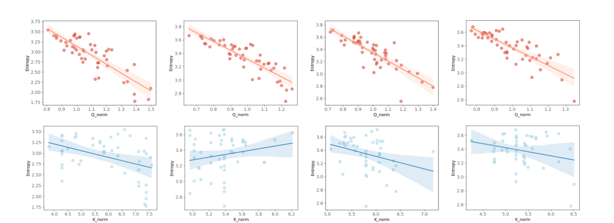
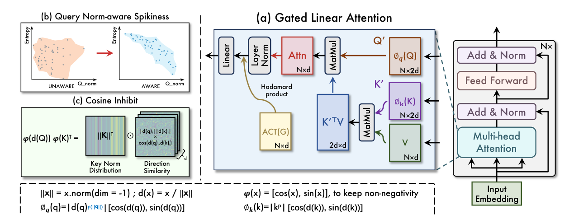
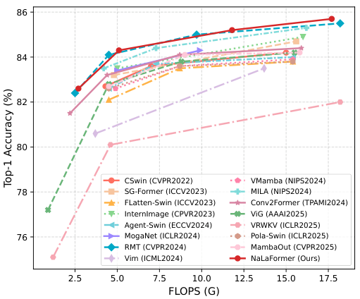

<div align="center">


# NaLaFormer

**Norm × Direction: Restoring the Missing Query Norm in Vision Linear Attention**

[](https://arxiv.org/abs/2506.21137)
[](https://arxiv.org/abs/2506.21137)
[](https://pytorch.org/)
[](https://www.python.org/)
[](LICENSE)
[](https://github.com/ZacharyMeng/NaLaFormer/stargazers)

[Weikang Meng](https://github.com/ZacharyMeng), Yadan Luo, Liangyu Huo, Yingjian Li, Yaowei Wang, Xin Li, Zheng Zhang

*International Conference on Machine Learning (ICML), 2026*

</div>

---

## 📰 News

- **[2026.07]** 🎉 NaLaFormer is accepted by **ICML 2026**!
- **[2026.06]** 🚀 Code and ImageNet-1K training recipes are released.
- **[2026.06]** 📄 Paper available on [arXiv](https://arxiv.org/abs/2506.21137).

## ✨ Highlights

- **A fresh diagnosis of linear attention.** We pinpoint two root causes of its expressiveness gap: (1) normalization *cancels the query norm*, destroying the norm–spikiness correlation that softmax attention enjoys; (2) standard non-negativity tricks *nullify valid inner-product interactions*, causing destructive information loss.
- **A principled fix — Norm × Direction (ND) decomposition.** A query-norm-aware feature map restores attention spikiness, while a cosine-based direction similarity guarantees non-negativity *without* discarding fine-grained inner-product information.
- **Strong accuracy–efficiency trade-off.** NaLaFormer scales from **8M to 95M** parameters and consistently outperforms representative CNNs and Transformers on ImageNet-1K — e.g. **84.3%** Top-1 with only 26M params / 5.1G FLOPs.

## 📖 Introduction

Linear attention mitigates the quadratic complexity of softmax attention but suffers from a critical loss of expressiveness. We identify two primary causes:

1. **The missing query norm.** The normalization operation cancels the query norm, which breaks the correlation between a query's norm and the spikiness (entropy) of the attention distribution as in softmax attention.
2. **Destructive non-negativity.** Standard techniques for enforcing non-negativity cause information loss by nullifying valid inner-product interactions.

<div align="center">

<p><em>Visualization of the correlation between entropy and vector norm: query norms correlate strongly
with entropy in softmax attention (top), while key norms exhibit only weak correlation (bottom).</em></p>
</div>

To address these challenges, we propose **NaLaFormer**, a novel linear attention mechanism built upon a **Norm × Direction (ND)** decomposition of the query and key vectors, which achieves a superior balance between expressive capability and efficiency:

- **Query-norm-aware feature map** — the query norm is injected into the kernel, restoring the attention distribution's spikiness.
- **Cosine direction similarity** — direction vectors are compared with a geometric, cosine-based metric that guarantees non-negativity while preserving the rich, fine-grained information of the inner product.

<div align="center">

<p><em>The overall framework of NaLaFormer: (a) gated linear attention with the ND-decomposed kernel,
(b) query-norm-aware spikiness, and (c) cosine inhibit for non-negativity.</em></p>
</div>

## 📊 Results

ImageNet-1K classification at 224² resolution, trained from scratch:

| Model | Params | FLOPs | Top-1 Acc (%) |
| :---: | :---: | :---: | :---: |
| NaLaFormer-XT | 8M | 1.0G | 79.1 |
| NaLaFormer-T | 15M | 2.7G | 82.6 |
| NaLaFormer-S | 26M | 5.1G | 84.3 |
| NaLaFormer-B | 52M | 12G | 85.2 |
| NaLaFormer-L | 95M | 18G | 85.7 |

<div align="center">

<p><em>Efficiency analysis: Accuracy vs. FLOPs curves on ImageNet-1K.</em></p>
</div>

## 🗃️ Model Zoo

Pre-trained weights will be released soon. The following variants are supported:

| Model | Resolution | Params | FLOPs | Top-1 (%) | Config name | Weights |
| :---: | :---: | :---: | :---: | :---: | :---: | :---: |
| NaLaFormer-XT | 224² | 8M | 1.0G | 79.1 | `NALAFORMER_XT` | coming soon |
| NaLaFormer-T | 224² | 15M | 2.7G | 82.6 | `NALAFORMER_T` | coming soon |
| NaLaFormer-S | 224² | 26M | 5.1G | 84.3 | `NALAFORMER_S` | coming soon |
| NaLaFormer-B | 224² | 52M | 12G | 85.2 | `NALAFORMER_B` | coming soon |
| NaLaFormer-L | 224² | 95M | 18G | 85.7 | `NALAFORMER_L` | coming soon |

See [MODEL_ZOO.md](MODEL_ZOO.md) for detailed per-variant architecture configurations.

## 🚀 Getting Started

### Installation

```bash
git clone https://github.com/ZacharyMeng/NaLaFormer.git
cd NaLaFormer

conda create -n nalaformer python=3.9 -y
conda activate nalaformer

pip install torch==2.4.0 torchvision==0.19.0 --index-url https://download.pytorch.org/whl/cu121
pip install -r requirements.txt
```

### Data Preparation

The ImageNet-1K dataset should be organized as follows:

```
imagenet
├── train
│   ├── class1
│   │   ├── img1.jpeg
│   │   └── ...
│   └── ...
└── val
    ├── class1
    │   ├── img4.jpeg
    │   └── ...
    └── ...
```

### Evaluation

Evaluate a pre-trained model on the ImageNet validation set:

```bash
python -m torch.distributed.launch --nproc_per_node=8 --use_env main.py \
    --model NALAFORMER_XT \
    --data-path <imagenet-path> \
    --output_dir <output-path> \
    --eval --dist-eval
```

### Training from Scratch

See `pretrain.sh` for the full recipe, or simply run:

```bash
export DATA=/path/to/imagenet
export CUDA_VISIBLE_DEVICES=0,1,2,3,4,5,6,7
export NPROC=8
bash pretrain.sh
```

Specify other variants via `--model`, e.g. `NALAFORMER_T`, `NALAFORMER_S`, `NALAFORMER_B`, `NALAFORMER_L`.

## 📁 Repository Structure

```
NaLaFormer/
├── NaLaformer/
│   ├── NALA.py        # NaLaFormer backbone & Norm-Aware Linear Attention
│   ├── main.py        # training / evaluation entry point
│   ├── engine.py      # train & eval loops
│   ├── datasets.py    # ImageNet data pipeline & augmentations
│   ├── losses.py      # soft-target / label-smoothing criterion
│   ├── samplers.py    # RASampler for distributed training
│   ├── utils.py       # EMA, checkpointing, metrics, misc.
│   └── pretrain.sh    # ImageNet-1K pre-training recipe
├── assets/            # logo & paper figures used in this README
├── MODEL_ZOO.md       # detailed variant configurations
├── requirements.txt
└── README.md
```

## ✅ TODO

- [x] Release ImageNet-1K training & evaluation code
- [ ] Release pre-trained weights
- [ ] Downstream tasks: object detection & semantic segmentation
- [ ] Throughput / latency benchmark scripts

## 📝 Citation

If you find this repo helpful, please consider citing us:

```bibtex
@inproceedings{meng2026nalaformer,
  title     = {Norm$\times$Direction: Restoring the Missing Query Norm in Vision Linear Attention},
  author    = {Weikang Meng and Yadan Luo and Liangyu Huo and Yingjian Li and Yaowei Wang and Xin Li and Zheng Zhang},
  booktitle = {International Conference on Machine Learning},
  year      = {2026}
}
```

## 🙏 Acknowledgements

This codebase builds upon the excellent open-source projects [timm](https://github.com/huggingface/pytorch-image-models), [DeiT](https://github.com/facebookresearch/deit) and [Swin Transformer](https://github.com/microsoft/Swin-Transformer). We thank the authors for their great work.

## 📄 License

This project is released under the [MIT License](LICENSE).
